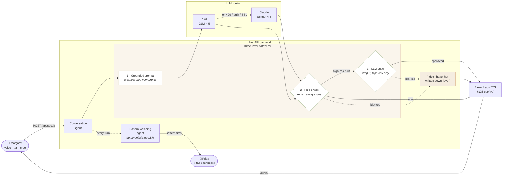

# Anchor

**A companion that holds memory for people who are losing theirs.**

Global AI HackTour · London 2026 · **Track 2 — Inclusion**
Team **404-Team-Not-Found**

> *Designed for the 944,000 people in the UK with dementia who are routinely left out of AI product design — and for the daughters and sons who carry the load.*

🔗 **Live demo:** <https://anchor-uguz.onrender.com>
🎛️ **Carer demo console:** <https://anchor-uguz.onrender.com/demo?key=shortbread>
🎞️ **Slide deck:** [`docs/Anchor Slide Deck.pptx`](./docs/Anchor%20Slide%20Deck.pptx)

---

## The human story

Margaret is 74. She lives alone in Salford. Last year she was diagnosed with early-stage Alzheimer's.

Her daughter Priya calls on the way to work. Priya has two kids and her own job, and every evening when she opens her phone there are twelve missed calls from Mum. Asking the same three questions.

> *What day is it. When are you coming. Where is Robert.*

Robert is Margaret's husband. He died in 2019.

Every carer we spoke to told us the same thing. It isn't the memory loss that breaks them. It's **being the only answer**. Anchor is built so Priya doesn't have to be.

> *Anchor doesn't help Margaret remember. It remembers for her, so she can keep being herself.*

---

## What it is

Two web apps that share one brain.

- **Margaret's app** — one soft amber circle, no menus. Speak, tap, or type. Warm replies drawn only from Margaret's profile, family, routine, and calendar. Never invents a fact. Never corrects a painful truth.
- **Priya's dashboard** — seven tabs: live alerts, medication tracker, a browsable conversation log with the safety rail visible, a read-only memory view with a gap-resolution queue, a schedule editor with live Google Calendar sync, a family photo and voice-message manager, and seven-day insights.

Both surfaces are a Progressive Web App — installable on any phone, works offline for the shell, no native build, no app store.

---

## Why it's an inclusion story

People with dementia are a population almost entirely designed-out of modern AI. Mainstream voice assistants assume intact short-term memory. Chatbots assume you can type, read paragraphs, and tolerate the occasional made-up fact. Screens assume you understand that a button is a button.

Anchor inverts every one of those defaults.

| Default AI assumes… | What dementia reality needs | How Anchor delivers |
|---|---|---|
| You remember what you just said | Every exchange is the first | No "you already asked", no "remember when" — same warmth every time |
| A made-up answer is acceptable friction | An invented fact can distress for hours | Two-layer safety rail that refuses rather than invents |
| You can read and navigate a UI | Cognitive overload triggers agitation | One circle. Three input paths. No menus. |
| You'll tolerate a difficult truth | Telling someone their spouse died restarts the grief | Painful-truth redirect, rule-enforced |
| You'll ask for help when you need it | Forgetting means not noticing you've forgotten | A second agent watches the pattern and nudges the carer |

Inclusion isn't a label we added. It's the entire design brief.

## The hardest thing Anchor does

Most AI assistants answer confidently. The hardest thing Anchor does is **refuse gracefully**.

### Three layers of safety
1. **Grounded-only prompting.** The LLM sees a structured memory block of Margaret's facts and is instructed to answer only from it. Fallback is a fixed warm refusal: *"I don't have that written down, love. Shall we ask Priya?"*
2. **Rule-based hallucination check (always on, ~1 ms).** Every mid-sentence capitalised word in a reply must exist in Margaret's memory block, or the reply is blocked and the gap is logged for the carer.
3. **LLM critic at temperature 0 (high-risk turns only).** A second model reviews replies to questions about medication, falls, fear, or deceased relatives — catching semantic hallucinations the regex can't, and blocking anything that would correct Margaret's painful truths.

### A second agent that notices drift the patient can't — *PatternWatch*
A deterministic observation agent watches every turn alongside the LLM. If Margaret asks about the same family member three-plus times in six hours and there's no visit or call for them on the live calendar, it pages her daughter with a soft "Pattern insight" notification. **No LLM is in that loop** — it's observe → store → retrieve → compare → decide → act, fully auditable, 12-hour per-person cooldown, and deceased family filtered at record-time so it never fires a tragic alert. Inclusion means noticing for her, not asking her to notice.

**Research lineage for PatternWatch:**
- Anthropic's *lead-planner-with-parallel-subagents* engineering pattern — for a secondary deterministic agent running alongside the primary LLM with its own state and decision loop
- **SOAN** (Wu et al., *Self-Organizing Agent Network*, AAAI 2026, arXiv:2508.13732) — the graded-urgency soft-escalation framework that underlies our `classify_urgency()`; PatternWatch extends it with a third `insight` class for non-alarming drift notifications
- Runtime-monitoring / shield-synthesis from formal methods — a deterministic monitor running alongside a potentially unsafe policy, producing a bounded safety signal without intervening in the primary decision loop
- **Ecological Momentary Assessment** methodology (Stone & Shiffman, *Annals of Behavioral Medicine*, 1994) — passive observation to detect behavioural drift in patients who cannot reliably self-report

The core research concepts already in the code (grounded critic, memory-gap logging, cross-app coordination, graded urgency) are enumerated with paper citations in [`anchor/README.md`](./anchor/README.md#research-concepts-implemented).

### Dual-LLM production resilience
Primary: **Z.AI GLM-4.5**. Automatic fallback on 429 / auth / SSL error: **Anthropic Claude Sonnet 4.5**, latched per process with a shim class that preserves the OpenAI response shape. Our Z.AI credit ran out mid-hackathon and every request now routes through Claude — which turned a cost problem into a live demonstration of the story we wanted to tell anyway.

---

## Architecture at a glance



*Dashed arrows are asynchronous or conditional. The two agents run independently — the conversation agent answers Margaret; the pattern-watching agent observes the conversation and nudges Priya when Margaret drifts. They never talk to each other.*

<details>
<summary>Text-mode fallback (for terminal / non-Mermaid readers)</summary>

```
Patient phone (PWA) ──► FastAPI backend ──► GLM-4.5 → Claude fallback
                             │
                             ├── Memory retrieval (patient_profile.json)
                             ├── Google Calendar ICS (no OAuth, 60s cache)
                             ├── verify_grounded (rule-based)
                             ├── verify_with_critic (LLM, temp 0)
                             ├── patterns agent (deterministic)
                             └── ElevenLabs TTS (MD5-cached)
                             │
Carer phone (PWA) ◄───── data/*.json (polled every 2 s)
```

</details>

**Stack:** FastAPI + Uvicorn · Python 3.12 · vanilla HTML/CSS/JS · no build step · deploy on Render free tier.

---

## Repository layout

```
404-Team-Not-Found-HACKTOUR/
├── README.md                    ← you are here
├── render.yaml                  ← Render Blueprint (auto-deploy on push)
├── anchor/                      ← the application
│   ├── README.md                ← deeper technical README
│   ├── backend/                 ← FastAPI app, safety rails, agentic agent
│   ├── frontend/                ← patient + carer HTML/CSS/JS, PWA assets
│   ├── scripts/                 ← reset + seed utilities
│   ├── demo/                    ← stage choreography
│   ├── requirements.txt         ← pip dependencies
│   └── pyproject.toml           ← uv dependencies
└── docs/
    ├── anchor_build_plan.md         ← engineering plan, daily scope decisions
    ├── anchor_concepts.md           ← the four research concepts in the code
    ├── hackathon_context.md         ← inclusion framing, judging lens
    └── Anchor Slide Deck.pptx       ← pitch deck
```

---

## Run it locally

```bash
cd anchor
cp .env.example .env             # set GLM_API_KEY, ANTHROPIC_API_KEY, ELEVENLABS_API_KEY
uv sync
uv run uvicorn backend.main:app --reload --port 8000
```

Then open:
- <http://localhost:8000/> — Margaret
- <http://localhost:8000/carer> — Priya
- <http://localhost:8000/?demo=1> — both on one screen (pitch overlay)

See [`anchor/README.md`](./anchor/README.md) for full setup, environment variables, pip-fallback install, and demo-reset workflow.

---

## What Anchor is *not*

This section matters.

- **Not HIPAA / UK GDPR compliant.** Hackathon prototype with synthetic data only. Production deployment needs ICO registration, a DPA with the LLM provider, and encryption at rest — a three-month programme on its own.
- **Not clinically validated.** We consulted no geriatrician, OT, or dementia specialist nurse. Every domain professional has scripted redirects for utterances Anchor doesn't handle yet (sundowning, visual hallucinations, specific Lewy-body or vascular patterns).
- **Not a medical device.** Anchor will never give medical advice. It defers to "Priya or the GP" by prompt instruction and critic enforcement.
- **Not a replacement for a carer.** It reduces the load — it doesn't remove it.
- **Not multi-patient.** One deployment, one Margaret. Multi-tenancy was out of scope.

---

## Credits

- Language models: **Z.AI GLM-4.5** (primary), **Anthropic Claude Sonnet 4.5** (fallback)
- Voice + music: **ElevenLabs** (TTS and Music API)
- Family portraits: **Runware** (SDXL watercolours)
- Deployment: **Render**
- Typography: Cormorant Garamond + DM Sans
- Dementia statistics sourced from [Alzheimer's Research UK](https://www.dementiastatistics.org/about-dementia/prevalence-and-incidence)

*Margaret is a fictional persona. No real patient was consulted, recorded, or represented in the building of this prototype.*

---

**Tagline:** *Your AI companion that cares, remembers, and supports.*
